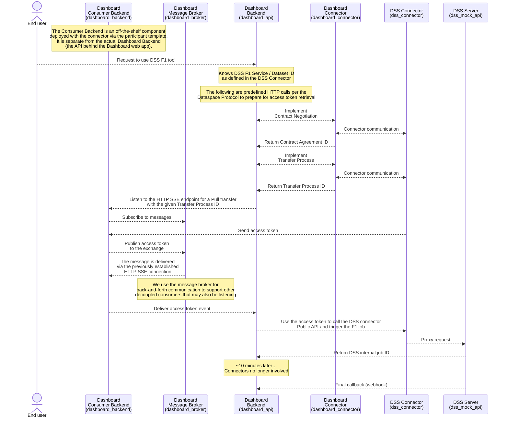

# Dashboard-DSS Integration Example

This is a proof-of-concept implementation that demonstrates how the Dashboard interacts with the DSS F1 (Energy Optimization) tool using data space connectors. Both the Dashboard and DSS components are mock implementations: they do not contain any real business logic, and all interactions are random and hardcoded. The purpose of this repository is to show how connector-based communication can be set up and tested.

This example uses the pre-built `agmangas/edc-connector` Docker image and demonstrates the complete flow from the sequence diagram below.

## Prerequisites

- **Docker** with Docker Compose v2 support
- **Task** (go-task) - Task runner for executing commands ([installation guide](https://taskfile.dev/installation/))
- **OpenSSL** - For SSL certificate generation (usually pre-installed on Linux/macOS)
- **jq** - JSON processor for parsing API responses
- **curl** - HTTP client for API testing

## Sequence Diagram

### Component Mapping

| Diagram Participant        | Docker Service        | Description                             |
| -------------------------- | --------------------- | --------------------------------------- |
| Dashboard Backend          | `dashboard_api`       | Main orchestration service (FastAPI)    |
| Dashboard Consumer Backend | `dashboard_backend`   | EDC consumer backend for SSE/messaging  |
| Dashboard Message Broker   | `dashboard_broker`    | RabbitMQ message broker                 |
| Dashboard Connector        | `dashboard_connector` | EDC connector (consumer)                |
| DSS Connector              | `dss_connector`       | EDC connector (provider)                |
| DSS Server                 | `dss_mock_api`        | Mock DSS F1 energy optimization service |



## Quick Start

You can deploy all the services, which are preconfigured for localhost access, using the `up` task:

```
task up
```

Once the services have stabilized (all services are up and running for about a minute), you can run the script to orchestrate the request from the Dashboard connector to the DSS connector:

```
task test-dss-request
```