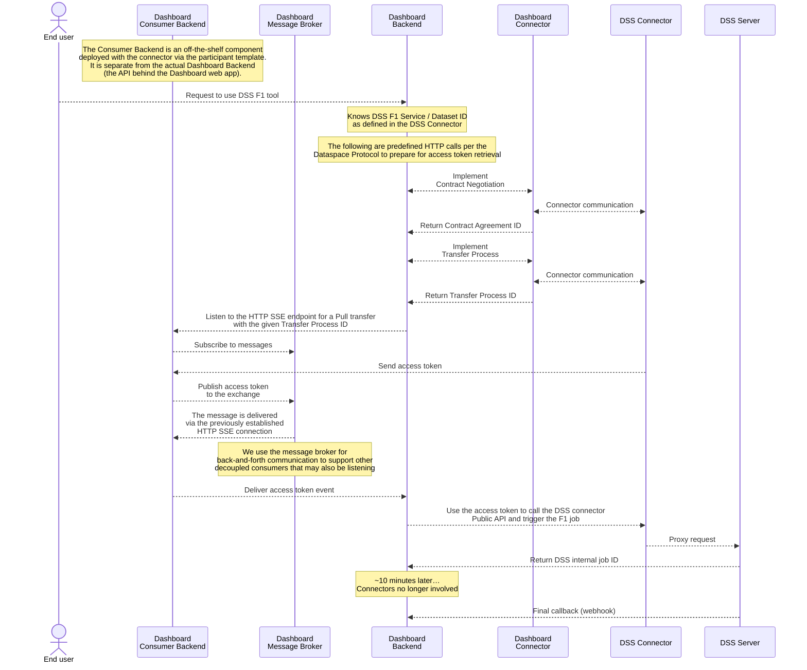

# Dashboard-DSS Integration Example

Proof-of-concept implementation demonstrating Dashboard interaction with the DSS F1 (Energy Optimization) tool via data space connectors.

This example uses the pre-built `agmangas/edc-connector` Docker image and demonstrates the complete flow from the sequence diagram below.



## Architecture

This proof of concept implements the complete data space integration flow using:

- **Dashboard Connector** (Consumer) - Handles contract negotiation and transfer processes
- **Dashboard Backend** - Consumer backend with message broker integration for access tokens
- **Dashboard API** - Main orchestration API that coordinates the DSS F1 tool requests
- **DSS Connector** (Provider) - Exposes DSS services to the data space using OpenAPI extension
- **DSS Mock API** - Simulates the actual DSS F1 (Energy Optimization) service
- **Message Broker** - RabbitMQ for decoupled communication between components

## Quick Start

### Prerequisites

- Docker and Docker Compose
- [Taskfile](https://taskfile.dev/) (`brew install go-task/tap/go-task` on macOS)

### Running the Environment

```bash
# Start the complete environment
task up

# Test the integration flow
task test-f1-request

# View logs
task logs

# Check container status  
task status

# Stop the environment
task down
```

### Available Endpoints

- **Dashboard API**: http://localhost:38000 (Main integration API)
- **Dashboard API Docs**: http://localhost:38000/docs
- **DSS Mock API**: http://localhost:18000 (Energy optimization service)
- **DSS Mock API Docs**: http://localhost:18000/docs
- **RabbitMQ Management**: http://localhost:15672 (guest/guest)

### Testing Energy Optimization

The system simulates a realistic energy optimization workflow:

```bash
# Request energy optimization for a building
curl -X POST "http://localhost:38000/f1/request-tool" \
  -H "Content-Type: application/json" \
  -d '{
    "building_id": "building_001",
    "optimization_type": "energy_efficiency", 
    "user_id": "test-user-001"
  }'
```

Results include:
- Energy savings (kWh)
- Cost reduction (EUR)
- CO2 reduction (kg)
- Optimization score
- Recommended efficiency actions

## Implementation Notes

- Uses `agmangas/edc-connector` Docker image (no local building required)
- Self-signed certificates generated automatically
- Simplified authentication (no Verifiable Credentials)
- Mock services provide realistic energy optimization data
- Complete connector-to-connector communication via Dataspace Protocol