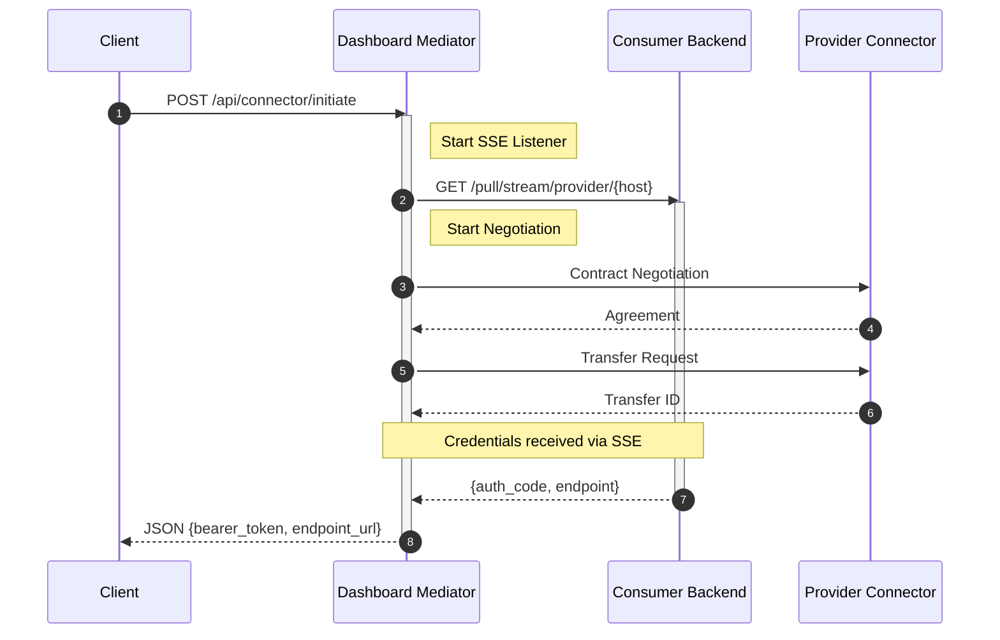

# Dashboard Mediator

The Dashboard Mediator is a FastAPI-based service designed to orchestrate Eclipse Dataspace Connector (EDC) contract negotiations and data transfers. It serves as an intermediary that automates the negotiation process, listens for transfer credentials via Server-Sent Events (SSE), and returns the necessary access tokens for data retrieval.

## Features

- **Automated Negotiation**: Initiates and manages the EDC contract negotiation and transfer process using `edcpy`.
- **Credential Management**: Receives transfer credentials real-time via SSE from a configured consumer backend.
- **Simple API**: Exposes a RESTful endpoint to trigger the negotiation workflow.
- **Docker Ready**: Fully containerized for easy deployment.

## Workflow


```mermaid
sequenceDiagram
    autonumber
    participant C as Client
    participant M as Dashboard Mediator
    participant CB as Consumer Backend
    participant P as Provider Connector

    C->>M: POST /api/connector/initiate
    activate M
    
    Note right of M: Start SSE Listener
    M->>CB: GET /pull/stream/provider/{host}
    activate CB
    
    Note right of M: Start Negotiation
    M->>P: Contract Negotiation
    P-->>M: Agreement
    
    M->>P: Transfer Request
    P-->>M: Transfer ID
    
    Note over CB, M: Credentials received via SSE
    CB-->>M: {auth_code, endpoint}
    deactivate CB
    
    M-->>C: JSON {bearer_token, endpoint_url}
    deactivate M
```

## Prerequisites

- Python 3.11+
- Poetry (for dependency management)
- Docker & Docker Compose (optional, for containerized execution)

## Configuration

The application is configured via environment variables. You can set these in a `.env` file or directly in your environment.

| Variable                              | Description                                 | Default                             |
| ------------------------------------- | ------------------------------------------- | ----------------------------------- |
| `DASHBOARD_CONSUMER_BACKEND_URL`      | URL of the backend providing SSE stream     | `http://dashboard_backend:28000`    |
| `DASHBOARD_API_KEY`                   | API key for authenticating with the backend | `dashboard-api-key`                 |
| `DASHBOARD_CONNECTOR_MANAGEMENT_PORT` | EDC Management API port                     | `29193`                             |
| `DASHBOARD_CONNECTOR_CONTROL_PORT`    | EDC Control API port                        | `29192`                             |
| `DASHBOARD_CONNECTOR_PUBLIC_PORT`     | EDC Public API port                         | `29291`                             |
| `DASHBOARD_CONNECTOR_PROTOCOL_PORT`   | EDC Protocol API port                       | `29194`                             |
| `DASHBOARD_CONNECTOR_HOST`            | Hostname of the EDC connector               | `certh.dashboard.datacellar.iti.gr` |
| `DASHBOARD_PARTICIPANT_ID`            | Participant ID for the connector            | `certh`                             |

## Installation & Running

### Local Development

1. **Install Dependencies**
   ```bash
   poetry install
   ```

2. **Run the Application**
   ```bash
   poetry run uvicorn main:app --reload --port 8002
   ```

### Docker

1. **Build and Start Services**
   ```bash
   docker-compose up --build
   ```

The service will be available at `http://localhost:8002`.

## API Reference

### Health Check

- **URL**: `/health`
- **Method**: `GET`
- **Description**: Returns the service health status.

### Initiate Negotiation

- **URL**: `/api/connector/initiate`
- **Method**: `POST`
- **Description**: Starts the EDC contract negotiation and transfer process for a specific asset.

**Request Body:**

```json
{
  "asset_id": "string",
  "provider_connector_protocol_url": "http://provider-host:port/protocol",
  "provider_connector_id": "string",
  "provider_host": "string",
  "query_params": {},
  "catalog_limit": 200
}
```

**Response:**

```json
{
  "bearer_token": "ey...",
  "endpoint_url": "https://..."
}
```
